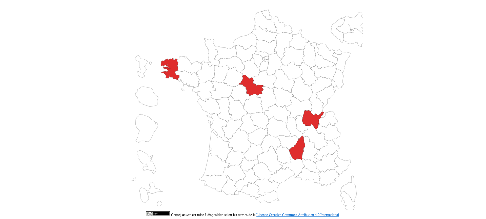

# Principes

Ce projet permet de
    - d'afficher les arrêtés préfectoraux concernant les rassemblement festifs.
    - de rechercher par mots clés les URLs contenant les arrêtés prefectoraux en PDF
    - de rechercher dans un PDF s'il y a un arrêté prefectoral concernant les rassemblement festifs

Le scraping et l'analyse de PDF peuvent être executées en python et à travers plusieurs noeuds TOR mais en mettant à contributions les utilisateurs du système, en executant le scraping depuis leur navigateur.

NOTE : La mise à contribution des utilisateurs sera potentiellement désactivée lorsque tout les départements seront stabilisés et que les noeuds tor seront déployés.

# Doc

## Backend

Programe Python avec le framework Flask.

### App.py

Ce fichier contient les différents endpoint de l'API Flask.

### Engine.py

Ce fichier représente les étapes pour naviguer par mots clés dans les sites des préfectures. 

Il permet donc de détecter les urls des RAA afin de remplir la base de données.

### Fetcher.py

Ce fichier est un wrapper d'un client http axé sur le scraping web.

Il permet d'y ajouter des nodes tor afin de changer d'ip en cas de code http [429 : Too many requests]

### Scraper.py

Parser des pages HTML, c'est un wrapper autour de beautifullsoup 

## UI

L'UI du programme utilise les technologies web natives html, css, js, sans surcouches ni framework

Le html est servie par l'API flask via template engine.



# Deploy

## Docker compose
```sh
docker-compose -f .\docker-compose.yml up --build --remove-orphans
```

# Tor proxies

## Installation
https://linux-man.fr/index.php/2022/02/12/proxy-tor/

## Webscraping
https://linux-man.fr/index.php/2022/02/26/webscraping-tor/